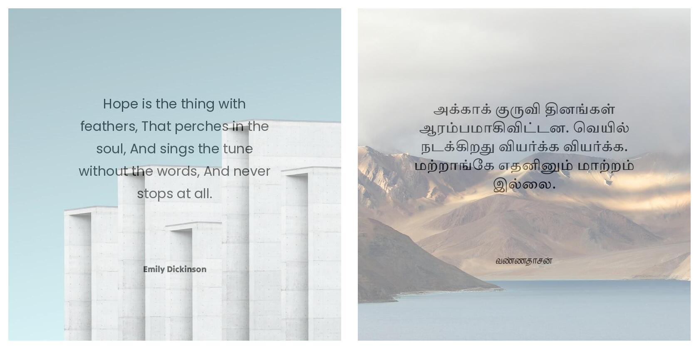

# Quote Creator Using Python PIL

The code was inspired from from [Muthu Krishnan's](https://muthu.co/instagram-quotes-generator-using-python-pil/) website.

This program will download a random image from unsplash and use it as the background.

Place the text inside the `sample.txt` file.

**Screenshots:**

**TODO:** The `textsize` in the program is deprecated and to be replaced by `textbbox` or `textlength`.
